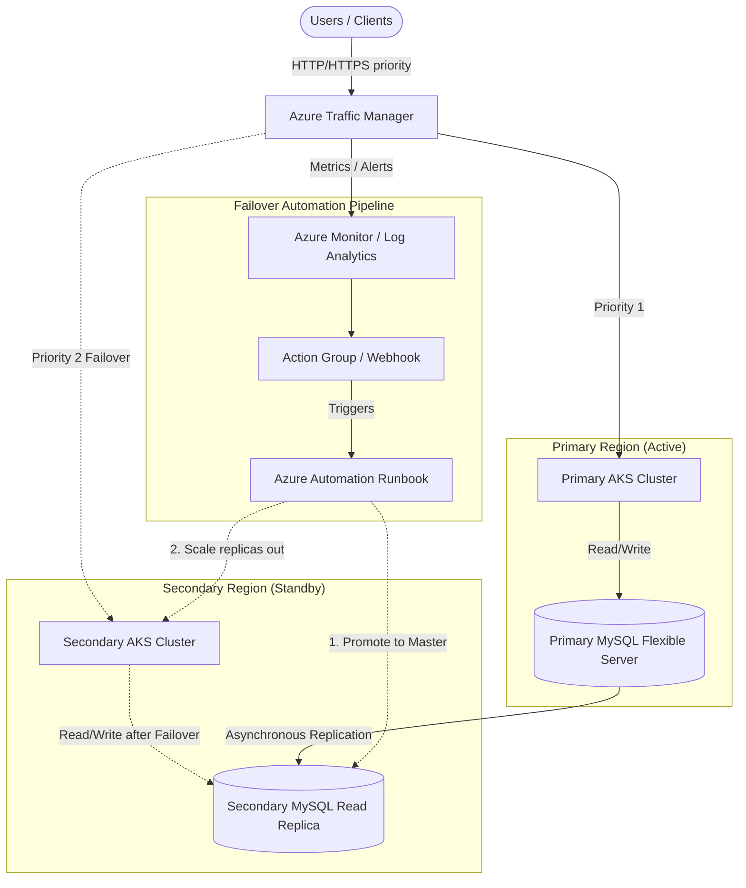

# Multi-Region Failure & High Availability Architecture

This project provisions a highly available, multi-region web application (WordPress) on Microsoft Azure. The architecture is designed to handle a sudden region failure seamlessly by routing traffic to a secondary standby region and automatically promoting secondary resources to production levels.

## System Architecture & Concept

The infrastructure spans across two Azure regions:
1. **Primary Region (Active):** Contains the primary Azure Kubernetes Service (AKS) cluster handling 100% of production traffic, and the primary Azure Database for MySQL Flexible Server serving as the master database with write access.
2. **Secondary Region (Standby):** Contains a secondary AKS cluster scaled down (to minimize costs) and a MySQL Flexible Server running as a Read Replica, continually syncing data from the primary database asynchronously.

A global DNS router, **Azure Traffic Manager**, operates at the apex of the architecture, actively probing and routing traffic based on priority routing.

### Core Components
* **Azure Traffic Manager:** Configured with "Priority" routing method. The Primary endpoint is Priority 1, and the Secondary endpoint is Priority 2.
* **Azure Kubernetes Service (AKS):** Hosts the containerized application. Primary cluster scales from 1 to 3 nodes. Secondary cluster operates with minimal footprint (1 node) during normal operations.
* **Azure Database for MySQL (Flexible Server):** A primary master database and a secondary read-replica tied via asynchronous replication, residing in delegated subnets with Private DNS integration.
* **Azure Automation & Log Analytics:** Provides the "glue" for automating the disaster recovery pipeline. Detects failure and triggers a recovery runbook.

---

## Architecture Diagram

---

## Failover Flow (Disaster Recovery)

When the Primary Region experiences an outage or becomes unresponsive, the automated failover sequence is initiated:

### 1. Detection
* **Traffic Manager Probes:** Azure Traffic Manager continuously monitors the HTTP endpoint of the primary AKS cluster.
* **Failover Initiation:** If 3 consecutive probes fail, Traffic Manager marks the primary endpoint as `Degraded` and automatically begins directing all user traffic to the secondary endpoint (Secondary AKS).

### 2. Automation Trigger
* Application Insights / Log Analytics detects the Traffic Manager metric drops or failover event.
* An Azure Monitor Alert fires, triggering an **Action Group**.
* The Action Group invokes a webhook linked to an **Azure Automation Runbook** (`failover_runbook.py`).

### 3. Execution (Python Runbook flow)
The Azure Automation Runbook uses a System Assigned Managed Identity with RBAC permissions (Contributor / AKS Admin) to orchestrate the backend recovery:
* **Promote Database:** The runbook issues a command to stop replication and promote the MySQL Read Replica in the secondary region to a standalone Primary database. This makes the database writable for the new incoming traffic.
* **Scale Compute:** The runbook connects to the secondary AKS cluster and actively scales up the replica count (or node pools) to accommodate the sudden influx of production traffic securely.
* **Config Update:** If required, the runbook patches the secondary Kubernetes deployments to point to the newly promoted standalone database.

### 4. Recovery Complete
Users transparently continue interacting with the application via the secondary region. Once the primary region comes back online, an administrator can manually initiate a failback process to reset the primary/secondary relationship if desired.